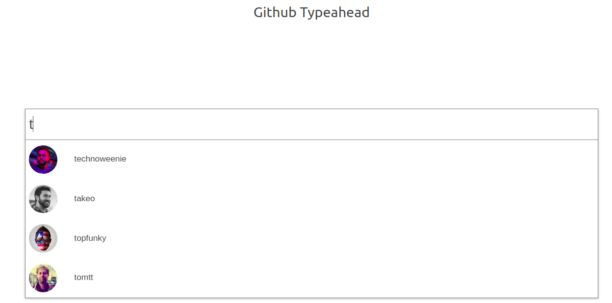

# Getting Started with Create React App

This project is based on creating a Github typeahead without using a prebuilt drop-down component. Rather, the Github api and swr.vercel.app is used for data fetching and displaying the user name and profile photo of Github users on the typeahead. The typeahead is like a vector graphic and everything scales as the viewport increases or decreases in size. Create-react-app is used to bootstrap the project.

## Screenshot

## Live Demo

[View live demo of app](https://github-typeahead-ruby.vercel.app/)

# Project Specification

1. Use create-react-app to initialize a new React app.
2. Delete any unnecessary file or asset.
3. Use Github api and swr.vercel.app for data fetching.
4. The typeahead should be like a vector graphic.
5. Everything scales as the viewport increases or decreases in size.
6. Use github for your repo and vercel for deployment.

## Built With

- React
- React-Create-App
- npm
- CSS
- ES6
- swr.vercel.app
- Vercel

## Getting Started

To get a local copy up and running follow these steps:

### Prerequisites

- npm
- create-react-app

### Setup

- Clone the repository by running the code `git clone https://github.com/tGodson/github-typeahead.git`.
- cd into `github-typeahead` folder
- Run `npm install`.
- Run `npm start` from your command line to open your app in the browser.

## Deployment

### Install Vercel

follow to install the Vercel cli: https://vercel.com/guides/deploying-react-with-vercel-cra

👤 **Tendongze Godson**

- Github: [tGodson](https://github.com/tGodson)
- Twitter: [@tendongze95](https://twitter.com/tendongze95)
- Linkedin: [linkedin](https://www.linkedin.com/in/tendongzegodson)
- AngelList: [tendongze-godson](https://angel.co/u/tendongze-godson)

## Show your support

Give a ⭐️ if you like this project!

## Acknowledgments

[Train Effective](traineffective.com)